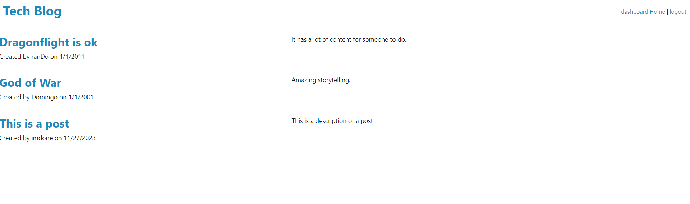

# mvc-techblog

An example of a mvc techblog. You can post, comment, edit post, or delete post.

## Installation

type mpn i in the terminal to donwload dependencies

## Usage

Go to the website, create an account. once logged in you will be redirected to the dashboard where you can create post. You can also edit or delete, or comment on post.

website: https://serene-tor-19683-970cd6d605fb.herokuapp.com/
## credits

N/A

## License

N/A